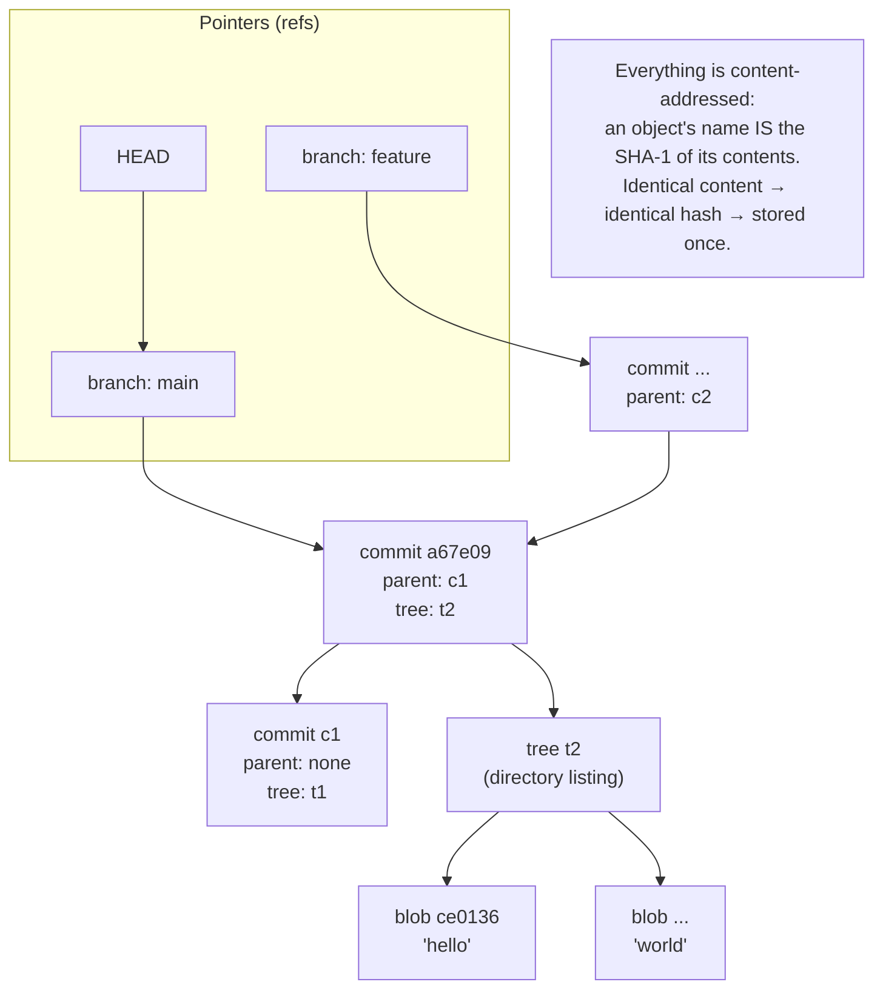

## In simple terms

Git is the most-used tool for tracking changes to code. You take snapshots ("commits"), give them messages, group them on branches, and share them with other people through a remote server like GitHub or GitLab. It is a [version control](/t/version-control) system, and the one that won.

## The Visual Map



## More detail

Git was created by Linus Torvalds in 2005 to coordinate development of the Linux kernel. Its key ideas:

- A repository is a **directed graph of commits**. Each commit points to the snapshot (tree) it captured and to one or more parents.
- Objects are **content-addressed**: every blob (file content), tree (directory), and commit is named by the SHA-1 hash of its own contents. Identical content is therefore stored exactly once.
- **Branches** are just movable pointers into the commit graph; `HEAD` points at your current branch.
- Every clone has the **full history**, so most operations are local and fast.

The day-to-day commands you use most:

| Command | Roughly does |
|---|---|
| `git clone <url>` | Copy a remote repo locally |
| `git status` / `git diff` | See what has changed |
| `git add <files>` / `git commit -m "..."` | Stage, then record a snapshot |
| `git push` / `git pull` | Sync with the remote |
| `git switch -c <branch>` | Make and switch to a new branch |
| `git merge` / `git rebase` | Combine branches |

Under the day-to-day "porcelain" commands sits a layer of "plumbing" (`hash-object`, `cat-file`, `rev-parse`) that exposes the object model directly — and reveals that Git is essentially a content-addressed key-value store with a commit graph layered on top.

## Under the Hood

Git names every object by the SHA-1 of its content, prefixed with a type-and-length header. You can reproduce a Git blob hash yourself — this Python computes the *exact* same hash `git hash-object` would:

```python
#!/usr/bin/env python3
"""Reproduce Git's content-addressed blob hash."""
import hashlib

content = b"hello\n"

# Git stores a blob as:  "blob <bytelength>\0<content>"  then SHA-1s the whole thing.
store = b"blob " + str(len(content)).encode() + b"\x00" + content
sha = hashlib.sha1(store).hexdigest()

print("content:", content)
print("git blob sha1:", sha)
# -> ce013625030ba8dba906f756967f9e9ca394464a
# Verify with:  printf 'hello\n' | git hash-object --stdin
```

Because the name is derived from the content, two files with identical bytes produce the *same* hash and are stored once; a commit is just another object whose content references a tree hash and parent hash(es). This content-addressing is why Git's integrity is self-verifying: change one byte anywhere and every hash up the chain changes.

## Engineering Trade-offs

**`merge` vs. `rebase`**
`merge` preserves exactly what happened, creating a merge commit that ties two histories together — truthful but cluttered. `rebase` replays your commits on top of the latest base for a clean, linear history that's easy to read and bisect — but it *rewrites* commits (new hashes), so rebasing anything already pushed and shared breaks collaborators. Truthful history versus tidy history is the recurring tension.

**Distributed full clones vs. repo size**
Every clone holding the entire history makes Git fast and offline-capable, but the model strains on very large repositories and big binary files — the whole history of every large asset comes along. Mitigations (shallow clones, partial clone, sparse-checkout, Git LFS) trade away some of the "you have everything locally" guarantee to stay usable at scale.

**Power vs. approachability**
Git's flexibility is enormous — almost any workflow is expressible. The cost is a famously confusing interface: overlapping commands, the staging area as a third state between working tree and history, and footguns like `push --force`. Much of the difficulty people attribute to "Git" is really its porcelain UI, not its elegant object model.

**Force-push power vs. shared-history safety**
Rewriting history (`commit --amend`, `rebase`, `push --force`) is invaluable for cleaning up *your own* work before sharing. The same operations on a shared branch silently discard others' commits and force everyone to reconcile — which is why `--force-with-lease` exists and why teams gate force-pushes on protected branches.

## Real-world examples

- **The Linux kernel** — the project Git was built for, coordinating tens of thousands of contributors.
- **Practically every open-source library** on GitHub, GitLab, and Bitbucket.
- **`git bisect`** finds the commit that introduced a regression in *log₂(n)* steps via binary search — a real-world algorithm you'll reach for the first time you face "it worked last week."
- **This very documentation project** is a Git repository, enriched one committed topic at a time.

## Common misconceptions

- **"`git push --force` is fine."** It's fine on your *own* unshared branch; on a shared branch it rewrites public history and discards teammates' work. Use `--force-with-lease`, which refuses if the remote moved unexpectedly.
- **"`git pull` is harmless."** `git pull` is `fetch + merge` (or rebase): it can create surprise merge commits or drop you into conflict resolution. Many prefer `git fetch` then an explicit merge/rebase.
- **"Git stores diffs between versions."** Git stores full *snapshots* as content-addressed objects (deduplicated by hash, then packed); diffs are computed on demand for display, not the storage format.

## Try it yourself

Watch Git's content-addressed object store directly, using its plumbing commands in a throwaway repo. Identical content produces an identical hash — and the tree shows both files pointing at the *same* blob:

```bash
# requires: git
tmp=$(mktemp -d); cd "$tmp"
git init -q
git config user.email demo@example.com && git config user.name demo

printf 'hello\n' > a.txt
blob=$(git hash-object -w a.txt)            # store the blob, print its SHA
echo "blob: $blob"
echo "type: $(git cat-file -t $blob)  content: $(git cat-file -p $blob)"

printf 'hello\n' > b.txt
echo "b.txt hashes to: $(git hash-object b.txt)   <- same hash: identical content"

git add a.txt b.txt && git commit -q -m "two files"
echo "tree of HEAD:"
git cat-file -p 'HEAD^{tree}'               # both files -> one shared blob

cd /; rm -rf "$tmp"
```

`a.txt` and `b.txt` have different names but identical bytes, so they share a single blob object (`ce0136…`) in the tree listing — Git stored the content once. That is content-addressing in action, and the same mechanism is what lets Git verify integrity and deduplicate across an entire history.

## Learn next

- [Version control](/t/version-control) — the general concept Git implements; the commit-graph and branching model in the abstract.
- [Code review](/t/code-review) — the collaboration practice built on Git branches and pull requests, where most teams gate changes.
- [CI/CD](/t/ci-cd) — automation triggered by Git pushes and merges that builds, tests, and deploys each change.
