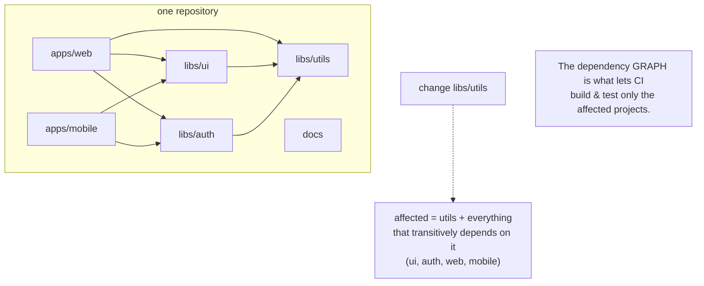

## In simple terms

A **monorepo** is one big repository that contains many projects — multiple services, libraries, and apps — all versioned together. The alternative, **polyrepo**, gives each project its own separate repo. In a monorepo, a single `git clone` gets you *everything*, and one commit can change several projects at once. It's how Google, Meta, and many others organise enormous codebases.

## The Visual Map



## More detail

The appeal of a monorepo is mostly **shared state and atomic change**:

- **One source of truth** — every team uses the same version of every shared library; no "service A is two versions behind on auth."
- **Atomic cross-project changes** — change a shared API and *every* caller in a single commit, so the repo is never in a broken intermediate state.
- **Shared tooling and config** — one build system, one lint config, one CI setup for everything.
- **Easy code sharing** — internal libraries are just folders, not published packages.

The costs are real and grow with size: **scale** (millions of files strain [Git](/t/git); large adopters use custom VCS, Meta's Sapling, or virtual file systems), **build/CI performance** (you must build and test *only what changed*, which needs dependency-aware tools like **Bazel**, **Nx**, **Turborepo**, or **Pants**), and **coupling/access control** (everyone sees everything, and discipline is needed to keep projects from tangling).

Crucially, "monorepo" is about *repository layout*, not architecture — a monorepo can hold microservices, and a polyrepo can hold a monolith. They're independent choices.

## Under the Hood

The thing that makes a monorepo fast is the **dependency graph**: when a package changes, CI rebuilds and retests only that package and everything that (transitively) depends on it. Here is that affected-set computation — the core of Bazel/Nx/Turborepo:

```python
#!/usr/bin/env python3
"""Compute the 'affected set': what to rebuild when a package changes."""

deps = {                       # package -> packages it depends on
    "web":    ["ui", "auth", "utils"],
    "mobile": ["ui", "auth"],
    "ui":     ["utils"],
    "auth":   ["utils"],
    "utils":  [],
    "docs":   [],
}

def affected(changed, deps):
    # Build the reverse graph: who depends ON each package.
    reverse = {p: [] for p in deps}
    for p, ds in deps.items():
        for d in ds:
            reverse[d].append(p)
    # Transitive closure of dependents, starting from the changed package.
    seen, stack = set(), [changed]
    while stack:
        p = stack.pop()
        if p in seen:
            continue
        seen.add(p)
        stack.extend(reverse[p])
    return sorted(seen)

for changed in ["utils", "ui", "docs"]:
    print(f"  change {changed:6} -> rebuild/test: {affected(changed, deps)}")
```

Changing `docs` rebuilds only `docs`; changing `ui` pulls in `web` and `mobile`; changing the base `utils` library rebuilds *everything* that imports it. Without this graph, every commit would have to build the entire repo — which is exactly why naive CI on a big monorepo is slow, and why dependency-aware build tools are not optional at scale.

## Engineering Trade-offs

**Atomic cross-project change vs. blast radius**
A monorepo lets you change a shared API and all its callers in one reviewable, never-broken commit — impossible across polyrepos without version juggling. The flip side is *coupling*: it's easy to create tight cross-project dependencies that a polyrepo's hard boundaries would have prevented, and a bad change to a base library can ripple everywhere at once.

**Shared tooling vs. forced uniformity**
One build system, one CI config, one lint setup means consistency and no per-repo reinvention. But it also forces every project onto the same toolchain and upgrade cadence; a team that needs a different language version or build tool has less freedom than they'd have in their own repo.

**Scale benefits vs. tooling investment**
The monorepo's advantages only materialise *with* dependency-aware builds and remote caching; plain Git plus "build everything" gets slower with every package added. You're trading the simplicity of small independent repos for a real, ongoing investment in build infrastructure that pays off only past a certain size.

**Visibility vs. access control**
Everyone seeing all the code aids discovery and refactoring, but makes fine-grained access control harder — you can't easily hide a sensitive service from most engineers when it's one folder among thousands. Polyrepos get per-repo permissions for free; monorepos need extra machinery (code owners, path-based controls).

## Real-world examples

- **Google** keeps most of its code in a single monorepo with billions of lines, served by custom infrastructure (Piper) and the Bazel build system.
- A startup uses **Turborepo** or **Nx** to hold its web app, mobile app, and shared component library in one repo with incremental, cached builds.
- **Babel** keeps dozens of related npm packages in one repo and publishes them together — a small, well-known monorepo.
- **Meta** built **Sapling** (a Git-compatible VCS) and virtual file systems specifically because off-the-shelf Git struggled with their monorepo's size.

## Common misconceptions

- **"Monorepo means one big monolithic application."** It's about *one repository*, not one deployable — a monorepo commonly holds many independently deployed microservices.
- **"Monorepos don't scale."** They scale fine *with the right build tooling and VCS*; it's plain Git on a huge repo, and naive "build everything" CI, that struggle — not the idea.
- **"Polyrepo gives you decoupling for free."** Separate repos enforce *boundaries*, but you can still create tight coupling through shared packages — and you pay for it with cross-repo version skew and non-atomic changes.

## Try it yourself

The other half of fast monorepo CI is **caching**: hash a package's inputs, and skip the build if the hash is unchanged (Turborepo and Bazel call this a cache hit). This models exactly that — only the package that actually changed rebuilds:

```bash
python3 - << 'EOF'
import hashlib
cache = {}

def build(pkg, source):
    key = hashlib.sha1(f"{pkg}:{source}".encode()).hexdigest()[:8]
    if key in cache:
        print(f"  {pkg:5}: CACHE HIT ({key}) - skipped")
        return
    print(f"  {pkg:5}: building... ({key})")
    cache[key] = f"artifact-{pkg}"

print("first run (cold cache):")
build("ui", "v1");  build("auth", "v1")
print("re-run, nothing changed:")
build("ui", "v1");  build("auth", "v1")     # both cache hits -> instant
print("ui changed to v2:")
build("ui", "v2");  build("auth", "v1")     # only ui rebuilds; auth stays cached
EOF
```

The first run builds both packages; the second skips both (inputs unchanged); after editing `ui`, only `ui` rebuilds while `auth` is served from cache. Combine this content-hash cache with the affected-set graph from Under-the-Hood and a thousand-package monorepo can validate a one-line change in seconds instead of rebuilding the world.

## Learn next

- [Version control](/t/version-control) — a monorepo is fundamentally a choice about how you organise version control; the trade-offs start here.
- [Git](/t/git) — the VCS most monorepos run on, and the one whose limits (history size, large files) the biggest monorepos must engineer around.
- [CI/CD](/t/ci-cd) — what makes a monorepo practical: a pipeline that uses the dependency graph and a build cache to test only what changed.
