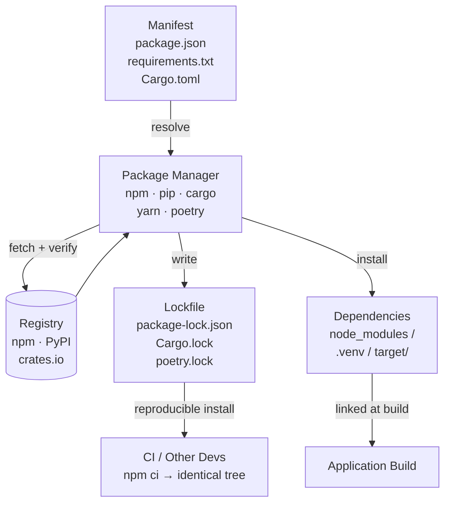

## In simple terms

Without a package manager, using a third-party library means downloading a zip file, figuring out its dependencies, downloading those, placing files in the right directories, and repeating for every transitive dependency. A package manager automates all of this: `npm install express` downloads Express and all its dependencies, places them in `node_modules`, and records the version in `package.json`. When your colleague clones the repo and runs `npm install`, they get exactly the same versions you have.

## The Visual Map



## More detail

**What a package manager does:**
1. **Dependency resolution** — reads your manifest, determines which versions of each package are mutually compatible, and produces a complete, consistent set of packages to install.
2. **Downloading and caching** — fetches packages from a registry (npm, PyPI, crates.io), caches them locally, and verifies integrity via checksums (SHA-256 or SHA-512).
3. **Installation** — places packages in the appropriate directories, creates shims or PATH entries.
4. **Version locking** — writes a lockfile (`package-lock.json`, `Cargo.lock`, `poetry.lock`) that pins exact versions of every dependency and transitive dependency, ensuring reproducible installs across machines and CI.
5. **Lifecycle scripts** — runs pre/post-install hooks.
6. **Publishing** — packages can be published to the registry for others to use.

**Version specifications (semver syntax):**
- `^1.2.3` — compatible with 1.2.3 (same major version, minor/patch ≥ 2.3).
- `~1.2.3` — only patch updates (1.2.x).
- `>=1.2.3 <2.0.0` — explicit range.
- `1.2.3` — exact pin.

**Dependency resolution algorithms:**
- **npm v3+:** flat `node_modules` — resolves a single version of each package where possible, deduplicates transitive dependencies.
- **Cargo:** enforces semver-compatible resolution; at most one version of a crate per major version in the tree.
- **pip 20.3+:** backtracking resolver; pip 23+ includes faster PubGrub-based solver. The older `--fast` mode broke on complex graphs.
- **Nix/Guix:** purely functional — each package installed in an immutable content-addressed store; multiple versions coexist without conflict.

**Lock files:** a lockfile pins every dependency's exact version and checksum. Committing lockfiles ensures reproducibility — all developers and CI use identical dependency trees. For applications, always commit the lockfile. For libraries, the convention varies (Cargo commits `Cargo.lock` for binaries, not for libraries, to avoid forcing downstream constraints).

**Security concerns:**
- **Supply chain attacks** — a malicious package maintainer can publish a backdoored version. `npm audit` scans installed packages for known vulnerabilities. Lockfiles prevent surprising version upgrades.
- **Typosquatting** — a malicious package named `colosr` (misspelling of `colors`) is installed accidentally.
- **Dependency confusion** — an attacker publishes a private-package name to a public registry; package managers may fetch the public one instead of the internal one.

**Workspaces / monorepo support:** npm workspaces, Cargo workspaces, pnpm workspaces — multiple packages in a single repository share a single dependency resolution and lockfile.

**Common package managers by ecosystem:**
- JavaScript/Node: npm, yarn, pnpm
- Python: pip, poetry, uv (Rust-based, 10–100× faster than pip)
- Rust: Cargo (official, excellent)
- Java: Maven, Gradle
- Go: go modules (built-in)
- .NET: NuGet
- Linux (system): apt (Debian), dnf (Fedora), pacman (Arch)
- macOS: Homebrew

Package managers are the foundation of modern software development. Without them, the ecosystem of reusable libraries would be impractical. npm has >2.5 million packages; PyPI >500,000; crates.io >130,000. Supply chain attacks via package managers have compromised millions of systems (event-stream, xz-utils, node-ipc incidents).

## Under the Hood

A package manager's core job is constraint solving — finding a set of package versions that satisfies all declared dependencies simultaneously. This is an NP-complete problem in the general case (equivalent to Boolean satisfiability). This Python script shows a simplified backtracking resolver:

```python
# Simplified dependency resolver (backtracking)
packages = {
    "express": {"1.0": {"lodash": "^4.0"}, "2.0": {"lodash": "^4.17"}},
    "lodash":  {"4.0": {}, "4.17": {}, "3.0": {}},
    "myapp":   {"1.0": {"express": "^1.0", "lodash": "^4.0"}},
}

def satisfies(version: str, constraint: str) -> bool:
    if not constraint.startswith("^"):
        return version == constraint
    req = constraint[1:].split(".")
    cur = version.split(".")
    return cur[0] == req[0] and version >= constraint[1:]

def resolve(pkg: str, constraint: str, selected: dict) -> bool:
    candidates = sorted(
        [v for v in packages.get(pkg, {}) if satisfies(v, constraint)],
        reverse=True,  # prefer newest
    )
    for ver in candidates:
        if pkg in selected and selected[pkg] != ver:
            continue   # conflict with already-selected version
        saved = selected.get(pkg)
        selected[pkg] = ver
        deps = packages[pkg][ver]
        if all(resolve(dep, req, selected) for dep, req in deps.items()):
            return True
        if saved is None:
            del selected[pkg]
        else:
            selected[pkg] = saved
    return False

result = {}
resolve("myapp", "1.0", result)
print("Resolved dependency tree:")
for pkg, ver in sorted(result.items()):
    print(f"  {pkg}: {ver}")
```

The real npm uses a variant of this with flattening and hoisting; Cargo uses PubGrub (a faster, complete algorithm published in 2020).

## Engineering Trade-offs

**What package managers solve:**
- Dependency management at scale would be impossible manually — a typical Node app has 500–1,000 transitive dependencies.
- Lockfiles make builds reproducible across developer machines and CI, eliminating "works on my machine" failures caused by dependency drift.
- Centralised registries (npm, PyPI) provide discovery, versioning, and security advisories in one place.

**Where package managers add risk:**
- **Transitive dependency explosion:** a small application's `node_modules` can easily reach 300 MB with thousands of packages — most of which the team has never reviewed. Each is a potential attack surface.
- **Left-pad problem:** deep dependency chains on trivial packages mean a single unpublished package can break thousands of builds (2016 npm left-pad incident).
- **Version hell:** competing packages may require incompatible versions of a shared dependency; pip pre-3.10 had no backtracking and would silently install a broken combination.
- **Supply chain attacks:** xz-utils (2024) showed that a patient attacker can spend years building trust before inserting a backdoor into a widely-distributed package.
- **Lockfile blind trust:** `npm ci` installs exactly what the lockfile says — including any previously unnoticed compromise. Audit lockfile changes as carefully as source changes.

## Real-world examples

- The `left-pad` npm incident (2016): a package with 11 lines of code, used transitively by thousands of projects, was unpublished — breaking builds worldwide. Demonstrated fragility of deep dependency chains.
- xz-utils backdoor (2024): a malicious contributor added a backdoor to a widely-used compression library distributed via package managers; discovered just before widespread exploitation.
- Renovate / Dependabot: automated tools that open PRs to update manifests to newer versions with security patches — the standard way to keep dependency trees current.

## Common misconceptions

- **"Committing `node_modules` is better than `package-lock.json`."** `node_modules` is huge and contains binary builds for the current platform. The lockfile + `npm ci` is the correct approach for reproducibility.
- **"Latest version is always safest."** Untested upgrades introduce bugs and sometimes security regressions. Use lockfiles, test upgrades in CI, and run `npm audit` / `pip-audit` before updating.

## Try it yourself

Simulate what a lockfile records — exact versions and integrity hashes for every package:

```bash
python3 - <<'EOF'
import hashlib, json

packages = [
    ("express",      "4.18.2",  b"express-4.18.2-source"),
    ("lodash",       "4.17.21", b"lodash-4.17.21-source"),
    ("body-parser",  "1.20.1",  b"body-parser-1.20.1-source"),
]

lockfile = {
    "lockfileVersion": 3,
    "packages": {
        f"node_modules/{name}": {
            "version": version,
            "resolved": f"https://registry.npmjs.org/{name}/-/{name}-{version}.tgz",
            "integrity": "sha256-" + hashlib.sha256(content).hexdigest()[:24],
        }
        for name, version, content in packages
    },
}

print("# package-lock.json (simplified excerpt)")
print(json.dumps(lockfile, indent=2))
print(f"\n{len(packages)} packages pinned — 'npm ci' will install exactly these versions")
EOF
```

## Learn next

- [Semantic versioning](/t/semantic-versioning) — the `^1.2.3` and `~1.2.3` constraint syntax that package managers use depends entirely on semver conventions
- [Vulnerability](/t/vulnerability) — supply chain attacks target package registries; understanding CVEs and vulnerability databases is essential for `npm audit` / `pip-audit` triage
- [Container](/t/container) — containers extend the same idea to the OS level, bundling the app and all its system-level dependencies for fully reproducible deployment
- [CI/CD](/t/ci-cd) — package managers run in every CI pipeline; `npm ci` (install from lockfile without mutation) vs `npm install` is a critical CI distinction
