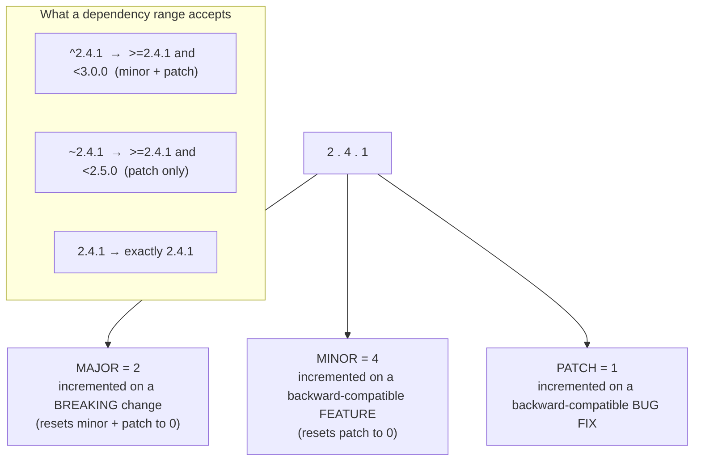

## In simple terms

**Semantic Versioning** (SemVer) is a simple rule for version numbers that makes them *mean something*. A version looks like **`MAJOR.MINOR.PATCH`** — for example `2.4.1`:

- **MAJOR** (the `2`) — a **breaking** change; code using the old version may stop working.
- **MINOR** (the `4`) — a **new feature** added in a backward-compatible way; existing code keeps working.
- **PATCH** (the `1`) — a **bug fix** with no new features and no breaking changes.

So `2.4.1` → `2.4.7` should be safe, `2.4.1` → `2.6.0` should add features without breaking you, but `2.4.1` → `3.0.0` is a warning: read the changelog, something changed that could break your code.

## The Visual Map



## More detail

SemVer turns a version number into a **contract** between a library and everyone who depends on it — and that contract is what makes automated dependency management possible. Package managers let you express which updates you'll accept automatically:

- `^2.4.1` ("caret") — any `2.x.y` ≥ `2.4.1`: minor and patch updates, but not `3.0.0`.
- `~2.4.1` ("tilde") — patch updates only (`2.4.x` ≥ `2.4.1`).
- `2.4.1` — exactly this version.

Conventions worth knowing: **`0.x.y`** versions are "anything goes" (pre-1.0 software may break on a minor bump); **pre-release** tags like `1.0.0-beta.2` and **build metadata** like `1.0.0+sha.5114f85` extend the scheme; and tools like **`semantic-release`** read structured commit messages (Conventional Commits) to compute the next version and publish automatically from [CI/CD](/t/ci-cd).

## Under the Hood

A version range is just a comparison rule. Here is the **caret** (`^`) logic that npm, Cargo, and friends apply — "same MAJOR, and at least the stated version":

```python
#!/usr/bin/env python3
"""How a package manager checks a caret (^) range."""
import re

def parse(v):
    return tuple(int(x) for x in re.match(r"(\d+)\.(\d+)\.(\d+)", v).groups())

def satisfies_caret(version, base):
    # ^base accepts the same MAJOR, at or above base (for MAJOR >= 1)
    return parse(version)[0] == parse(base)[0] and parse(version) >= parse(base)

base = "2.4.1"
for v in ["2.4.1", "2.4.7", "2.6.0", "3.0.0", "2.4.0"]:
    print(f"  ^{base} accepts {v}? {satisfies_caret(v, base)}")
```

Output: `2.4.1`, `2.4.7`, `2.6.0` are accepted (same major, ≥ base); `3.0.0` is rejected (major bump = possible breakage); `2.4.0` is rejected (below the floor). Tuple comparison (`(2,4,7) >= (2,4,1)`) gives correct precedence for free — Python compares element by element, exactly as SemVer orders versions.

## Engineering Trade-offs

**Automatic updates vs. supply-chain risk**
SemVer ranges (`^`, `~`) let tools auto-apply fixes across a dependency tree hundreds of packages deep without human coordination — the only thing that makes modern dependency graphs manageable. The risk: you're trusting *every* maintainer to honour the contract. One package shipping a breaking change in a "patch" can break thousands of builds, and an auto-pulled minor update is a vector for supply-chain attacks. Lockfiles exist to pin exact resolved versions as a counterweight.

**Strict honesty vs. release friction**
Honouring SemVer strictly means a tiny, technically-breaking change (renaming an internal-but-exported symbol) forces a major bump, which feels heavy and floods consumers with "major" churn. Loosening it (slipping a breaking change into a minor) reduces friction for the maintainer but silently breaks the promise downstream. The discipline costs the publisher; the value accrues to consumers.

**Caret vs. tilde vs. pinned**
Caret (`^`) maximises getting fixes and features automatically but trusts minor releases not to break. Tilde (`~`) accepts only patches — safer, but you miss features and must manually bump for them. Exact pins are maximally reproducible but you get *nothing* automatically, including security fixes. Teams usually combine generous ranges in the manifest with an exact lockfile to get both freshness and reproducibility.

**SemVer vs. other schemes**
SemVer encodes *compatibility* in the number, which is what dependency resolution needs. Alternatives like CalVer (`2026.06`) encode *time* — better for end-user apps where "how recent is this?" matters more than "will it break my code?" Neither is universally right: SemVer for libraries with API consumers, CalVer for shipped applications.

## Real-world examples

- `npm install`, `pip`, and `cargo` all resolve dependency versions using SemVer ranges declared in your manifest, then write exact versions to a lockfile.
- A **Dependabot / Renovate** bot opens a pull request to bump a patch release, trusting SemVer that the change is safe to merge after CI passes.
- A library's `3.0.0` release whose changelog opens with a "Breaking changes" section — exactly what a MAJOR bump is supposed to signal.
- **`semantic-release`** computes the next version from commit messages and publishes automatically, removing human guesswork from version numbering.

## Common misconceptions

- **"The version number is just a label the author picks."** Under SemVer it's a *promise* about compatibility; the number is supposed to be earned by the nature of the change, not chosen for vanity.
- **"A bigger version means more mature."** Not necessarily — a project on `47.0.0` just makes frequent breaking changes; one on `1.2.0` may be older and rock-solid. Version magnitude measures breaking-change frequency, not quality.
- **"`^1.2.3` and `^0.2.3` mean the same thing."** They don't — for `0.x`, the caret is special-cased to allow only patch updates (`>=0.2.3 <0.3.0`), because pre-1.0 minors are allowed to break.

## Try it yourself

Build the core of a dependency resolver: given a constraint and the versions available in a registry, pick the **highest version that satisfies** it — exactly what npm/pip/cargo do when they resolve your manifest:

```bash
python3 - << 'EOF'
import re
def parse(v):
    return tuple(int(x) for x in re.match(r"(\d+)\.(\d+)\.(\d+)", v).groups())

def resolve(constraint, available):
    if constraint[0] in "^~":
        op, base = constraint[0], constraint[1:]
    else:
        op, base = "=", constraint
    bmaj, bmin, bpat = parse(base)
    def ok(v):
        maj, mn, _ = parse(v)
        if op == "^": return maj == bmaj and parse(v) >= (bmaj, bmin, bpat)   # minor+patch
        if op == "~": return maj == bmaj and mn == bmin and parse(v) >= (bmaj, bmin, bpat)  # patch
        return parse(v) == (bmaj, bmin, bpat)                                  # exact
    matches = sorted([v for v in available if ok(v)], key=parse)
    return matches[-1] if matches else None   # highest satisfying version wins

available = ["2.3.9", "2.4.1", "2.4.7", "2.5.0", "2.6.3", "3.0.0", "3.1.0"]
for c in ["^2.4.1", "~2.4.1", "2.5.0"]:
    print(f"  {c:8} -> {resolve(c, available)}")
EOF
```

`^2.4.1` resolves to `2.6.3` (the newest `2.x`, stopping short of `3.0.0`); `~2.4.1` resolves to `2.4.7` (newest `2.4.x`); the exact pin resolves to itself. Add a `2.7.0` to the registry and watch `^2.4.1` jump to it — but never to `3.x`. That "newest compatible" rule, run across a whole dependency tree, is what `npm install` is doing under the hood.

## Learn next

- [Package manager](/t/package-manager) — the tool that consumes SemVer ranges, resolves the dependency graph, and writes the lockfile.
- [CI/CD](/t/ci-cd) — where automated release tools compute and publish the next SemVer version on every change.
- [Version control](/t/version-control) — versions are tags on commits; SemVer is the convention for *naming* what you release from source control.
