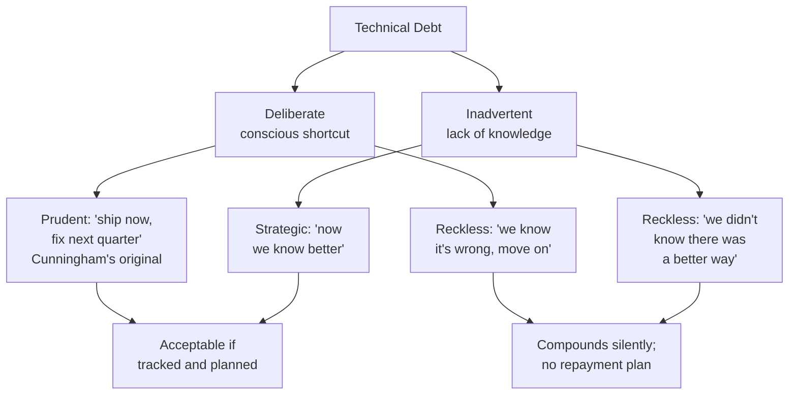

## In simple terms

**Technical debt** is what you take on when you ship something faster than you "should" — by skipping tests, copy-pasting instead of abstracting, ignoring a flaky warning, leaving a debt-marker comment in the code. Like financial debt, that shortcut buys you speed today but you pay interest tomorrow, every time someone has to work near that code. Manageable if you pay it down; ruinous if it just compounds.

## The Visual Map



## More detail

The metaphor was introduced by Ward Cunningham in 1992. He was clear it was about *deliberate, well-understood* shortcuts taken to learn faster — not about sloppy code. Steve McConnell later expanded the taxonomy:

- **Deliberate / prudent** — "we know this is hacky; we'll fix it next quarter". The only kind Cunningham endorsed.
- **Deliberate / reckless** — "we know this is hacky; we don't care".
- **Inadvertent / prudent** — "we now know we should have done it differently; we're learning".
- **Inadvertent / reckless** — "we didn't even know there was a better way".

The "interest" you pay:

- **Slower changes** — every modification near the debt takes longer.
- **More bugs** — fragile code breaks in surprising ways.
- **Higher onboarding cost** — new engineers spend longer figuring out the system.
- **Loss of confidence** — people work around the debt rather than through it.

Strategies for managing tech debt:

- **Boy Scout Rule** — leave the code cleaner than you found it. Many tiny refactors continuously.
- **Track it** — a debt registry / "engineering backlog" / Jira labels so it's visible to product.
- **Budget time for it** — 10–20% of capacity is a common rule of thumb.
- **Pay before extending** — refactor an area before adding a new feature to it.
- **Strangler pattern** for big legacy systems — wrap the old, route new functionality through new code, gradually retire the old.

When debt is OK to take:
- Validating a hypothesis (does this product idea work at all?).
- Hitting a deadline that genuinely matters (regulatory, demo, launch).
- The code you're cutting corners on will likely be deleted soon.

When debt is *not* OK:
- Foundational code that everything else will depend on.
- Code in the security or correctness path.
- "Just temporarily" — most temporary code becomes permanent.

Technical debt is often the single biggest reason teams slow down over time. Productively talking about it — both with engineers and with product managers — is essential to keeping a long-lived codebase healthy.

## Under the Hood

A simplified cyclomatic complexity calculator — one of the standard automated proxies for technical debt in a file. Tools like SonarQube, CodeClimate, and ESLint's `complexity` rule use the same principle:

```python
import re

def cyclomatic_complexity(source: str) -> int:
    """
    Cyclomatic complexity = 1 + number of branch points.
    Every if/elif/else/for/while/except/and/or adds a branch.
    Threshold: <= 10 is fine; > 15 is a debt signal.
    """
    branch_re = re.compile(
        r'\b(if|elif|else|for|while|except|with)\b|'
        r'(?<!\w)(and|or)(?!\w)'
    )
    branches = len(branch_re.findall(source))
    return 1 + branches

samples = {
    "simple getter": "def get_name(self):\n    return self.name",
    "moderate logic": """
def process(items):
    result = []
    for item in items:
        if item.active and item.balance > 0:
            result.append(item)
    return result
""",
    "deeply nested handler": """
def handle(req, ctx):
    if req:
        if req.user:
            if req.user.is_admin:
                if ctx.feature_enabled:
                    for item in req.items:
                        if item.valid:
                            try:
                                ctx.process(item)
                            except Exception:
                                pass
""",
}

for name, code in samples.items():
    cc = cyclomatic_complexity(code)
    risk = "OK" if cc <= 10 else ("WARN" if cc <= 15 else "DEBT")
    print(f"CC={cc:3}  [{risk}]  {name}")
```

## Engineering Trade-offs

**When accepting debt is rational:**
- Speed-to-market for a hypothesis validation: if the feature fails, the debt disappears with the feature.
- Regulatory deadlines with fixed dates: debt taken deliberately and logged is manageable.
- Short-lived code (migration scripts, one-off reports): paying down debt that will be deleted is waste.

**When debt compounds dangerously:**
- Core abstractions built on shaky foundations force every subsequent layer to work around them.
- Security-path shortcuts (authentication, session management) are exploitable, not just slow.
- Accumulated debt in high-churn files creates a "debt hotspot" where every change takes 3× longer and introduces bugs — measurable via `git log --name-only | sort | uniq -c | sort -rn`.
- Untracked debt is invisible to product; teams end up apologising for slowdowns instead of negotiating time to fix the real cause.

**The rewrite trap:** the "let's rewrite it properly" impulse almost always underestimates how much domain knowledge is encoded in the current "messy" code. Rewrites abandon that knowledge and reintroduce bugs that were silently fixed. The strangler fig pattern (gradually routing functionality through new code) almost always wins over big-bang rewrites.

## Real-world examples

- The Twitter **fail whale** era (late 2000s) was substantially a tech-debt story: the Ruby on Rails monolith hit scale limits; the team spent years migrating critical paths to Scala/JVM and decomposing the monolith.
- The **Y2K bug** was half a century of accumulated technical debt around two-digit year fields — costing an estimated $300–600 billion to mitigate.
- **Healthcare.gov launch (2013):** many integrated systems, no end-to-end testing, no real load testing — the launch failed publicly and required a months-long emergency cleanup.

## Common misconceptions

- **"All technical debt is bad."** Strategic debt taken consciously to learn faster is often the right call. The problem is unacknowledged, untracked debt.
- **"We'll fix it in the rewrite."** Rewrites famously underestimate how much knowledge is buried in the old code. Strangling the old system gradually almost always beats a full rewrite.

## Try it yourself

Scan code for common debt signals using a simple Python heuristic:

```bash
python3 - <<'EOF'
import re

code = """
def processData(d):
    # DEBT: refactor before next sprint
    x = d['items']
    result = []
    for i in range(len(x)):
        if x[i]['status'] == 'active':
            if x[i]['type'] == 'premium':
                if x[i]['balance'] > 0:
                    result.append(x[i])
    return result
    return result
"""

DEBT_MARKERS = r'\b(DEBT|SMELL|REFACTOR|HACK)\b'
smells = {
    "Debt marker comments":     len(re.findall(DEBT_MARKERS, code)),
    "Deep nesting (3+ levels)": len(re.findall(r'^\s{12,}\S', code, re.MULTILINE)),
    "range(len(x)) antipattern": len(re.findall(r'range\(len\(', code)),
    "Short variable names (1 char)": len(set(re.findall(r'\b[a-z]\b', code))),
    "Duplicate return statements": len(re.findall(r'\breturn\b[^\n]*\n[^\n]*\breturn\b', code)),
}

print(f"{'Smell':<35} {'Count':>6}  Signal")
print("-" * 55)
for smell, count in smells.items():
    signal = "DEBT" if count > 1 else ("WATCH" if count > 0 else "OK")
    print(f"{smell:<35} {count:>6}  {signal}")
EOF
```

## Learn next

- [Refactoring](/t/refactoring) — the mechanical practice of paying down debt: restructuring code without changing its external behaviour
- [Code review](/t/code-review) — the collaborative practice that catches debt before it merges, keeping the interest rate low
- [DORA metrics](/t/dora-metrics) — accumulated technical debt shows up as degrading lead time and rising change failure rate; DORA gives you a measurement framework to notice the slowdown
