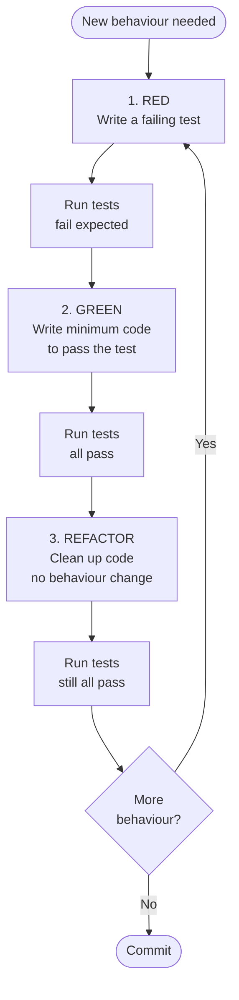

## In simple terms

Normal development: write code, then write tests (if you have time). TDD reverses this: write a test that fails (red), write the minimum code to make it pass (green), then refactor the code to be clean while keeping tests green. Repeat. The discipline forces you to think about the interface and behaviour *before* the implementation, resulting in naturally testable code and a complete test suite — because every feature was written to satisfy a test.

## The Visual Map



## More detail

**The TDD cycle:**
1. **Red** — write a small test for the next unit of behaviour. Run it; it fails (possibly doesn't even compile). This confirms the test is actually testing something new.
2. **Green** — write the *minimum* code to make the test pass. Don't worry about cleanliness. Resist the urge to generalise prematurely.
3. **Refactor** — clean up the code: extract duplication, rename things, improve structure. Run tests after each change to ensure nothing broke. The test suite is your safety net.

**What TDD produces:**
- **Test coverage** — by definition, every behaviour was written to satisfy a test. Coverage is near-complete without any separate effort.
- **Testable design** — code written test-first tends to have small functions, clear interfaces, and minimal hidden dependencies (because hidden dependencies make testing hard).
- **Regression safety** — the accumulated test suite catches regressions immediately.
- **Working documentation** — tests describe the expected behaviour of every unit.

**Unit TDD vs. Acceptance TDD (ATDD / BDD):**
- **Unit TDD** — tests operate at function/class level; fast, isolated.
- **ATDD / BDD (Behaviour-Driven Development)** — tests are written from the user's perspective, often in a domain language (Gherkin: `Given / When / Then`). Frameworks: Cucumber, RSpec, Jest with custom matchers. Encourages collaboration between developers and product owners.

**TDD with mocks:** test-first often requires stubbing dependencies (database, external APIs) so the unit under test can be exercised in isolation. Overuse of mocks creates tests that verify implementation details rather than behaviour — they break when you refactor without changing behaviour. Prefer testing through real objects where feasible.

**Limits of TDD:**
- Exploratory code (spikes) — writing tests first is unproductive when you don't know the design.
- UI testing — difficult to test-drive visual rendering.
- Integration and performance — TDD works best at unit level; integration tests have a different workflow.

**TDD ≠ 100% coverage:** TDD tends to produce high coverage naturally, but the goal is behaviour coverage, not line coverage. Testing every trivial getter/setter adds noise without value.

TDD was popularised by Kent Beck as part of Extreme Programming (XP). Studies consistently find TDD reduces defect rates by 40–80% compared to test-after development. More importantly, it changes the *design* of code: test-first code tends to be more modular, have fewer dependencies, and be easier to change. Teams that practise TDD spend less time debugging — the test suite catches regressions instantly.

## Under the Hood

A complete TDD cycle in Python — starting from an empty `Stack` class, adding one test at a time, and watching each test fail then pass:

```python
import unittest

# STEP 1: Write tests first (they'll all fail — Stack is empty)
class TestStack(unittest.TestCase):
    def test_new_stack_is_empty(self):
        s = Stack()
        self.assertEqual(s.size(), 0)

    def test_push_increases_size(self):
        s = Stack()
        s.push(42)
        self.assertEqual(s.size(), 1)

    def test_pop_returns_last_pushed(self):
        s = Stack()
        s.push(1)
        s.push(2)
        self.assertEqual(s.pop(), 2)

    def test_pop_decreases_size(self):
        s = Stack()
        s.push(99)
        s.pop()
        self.assertEqual(s.size(), 0)

# STEP 2: Minimum implementation to make tests green
class Stack:
    def __init__(self):
        self._items = []

    def push(self, item) -> None:
        self._items.append(item)

    def pop(self):
        return self._items.pop()

    def size(self) -> int:
        return len(self._items)

# STEP 3: Refactor if needed (here: already clean)
# Run: python -m unittest (all 4 tests pass)
if __name__ == "__main__":
    unittest.main(argv=[""], verbosity=2)
```

The key discipline: write ONE test, watch it fail, write the *minimum* code to pass, refactor, repeat. Don't skip ahead to write all tests before any code.

## Engineering Trade-offs

**Where TDD wins:**
- Forces interface design before implementation — the test *is* the first consumer of the API, so awkward APIs are felt immediately.
- Creates a complete, maintained test suite as a side effect — no separate "let's go back and add tests" phase that never happens.
- Makes refactoring safe: the test suite is the safety net, so the team can continuously improve code structure without fear of regression.
- Reduces debugging time dramatically — when a test fails, the failure points to a very small amount of newly written code.

**Where TDD adds friction:**
- Learning curve: the "write test first, watch it fail" discipline feels unnatural at first; developers skip the RED step, which defeats the purpose.
- Exploratory work ("spikes") — when you don't know the design yet, writing tests is premature. TDD works best when the expected behaviour is known.
- Mocking overhead: test-first requires isolating units, which often means mocking. Excessive mocking creates brittle tests that verify structure, not behaviour.
- UI and visual code is hard to test-drive; most teams TDD the logic layer and test the view layer differently.
- The 15–30% upfront time cost is real and feels expensive on short timelines. The payback is in reduced debugging and regression work later.

**The common failure mode:** developers write tests *after* code during a cleanup pass ("test-last" instead of "test-first"). The tests often end up testing implementation details rather than behaviour, and they don't drive design decisions.

## Real-world examples

- Google's "Testing on the Toilet" programme advocates for TDD across engineering teams; Google's engineering guide mandates high test coverage.
- The Django web framework was developed largely with TDD; its own test suite is extensive.
- Kent Beck built JUnit (the original xUnit test framework) to support TDD in Java; the xUnit pattern is now in every language.
- Open-source projects using TDD: Ruby on Rails, most popular Python libraries, Linux kernel's KUnit (C unit tests).

## Common misconceptions

- **"TDD means writing tests for everything."** TDD is about writing tests *before* code, for behaviour that matters. Trivial getters don't need tests; business logic does.
- **"TDD slows you down."** TDD adds ~15–30% time upfront and saves it later in debugging and regression fixes. For complex, long-lived codebases, it is net-positive.

## Try it yourself

The classic TDD kata — a string calculator that demonstrates the RED-GREEN cycle:

```bash
python3 - <<'EOF'
import unittest, io, sys

class StringCalculator:
    def add(self, numbers: str) -> int:
        raise NotImplementedError   # stub for RED phase

class TestCalc(unittest.TestCase):
    def test_empty_returns_zero(self):    self.assertEqual(StringCalculator().add(""), 0)
    def test_single_number(self):        self.assertEqual(StringCalculator().add("5"), 5)
    def test_two_numbers(self):          self.assertEqual(StringCalculator().add("1,2"), 3)
    def test_multiple_numbers(self):     self.assertEqual(StringCalculator().add("1,2,3"), 6)

buf = io.StringIO()
runner = unittest.TextTestRunner(stream=buf, verbosity=0)

print("=== RED (stub only) ===")
result = runner.run(unittest.TestLoader().loadTestsFromTestCase(TestCalc))
print(f"  {result.testsRun - len(result.failures) - len(result.errors)}/{result.testsRun} passed")

# GREEN: implement minimum code
class StringCalculator:
    def add(self, numbers: str) -> int:
        return 0 if not numbers else sum(int(n) for n in numbers.split(","))

class TestCalc(unittest.TestCase):
    def test_empty_returns_zero(self):    self.assertEqual(StringCalculator().add(""), 0)
    def test_single_number(self):        self.assertEqual(StringCalculator().add("5"), 5)
    def test_two_numbers(self):          self.assertEqual(StringCalculator().add("1,2"), 3)
    def test_multiple_numbers(self):     self.assertEqual(StringCalculator().add("1,2,3"), 6)

print("=== GREEN (minimum implementation) ===")
result = runner.run(unittest.TestLoader().loadTestsFromTestCase(TestCalc))
print(f"  {result.testsRun - len(result.failures) - len(result.errors)}/{result.testsRun} passed")
EOF
```

## Learn next

- [Unit test](/t/unit-test) — the specific test type TDD produces; understanding what makes a good unit test (fast, isolated, deterministic) makes TDD faster and less painful
- [Domain-driven design](/t/domain-driven-design) — TDD and DDD pair naturally: tests are written against the domain model directly, catching invariant violations before they reach the database
- [Debugging](/t/debugging) — a strong TDD test suite transforms debugging from "where is the bug" to "which test caught it" — the failing test is the starting point for every investigation
