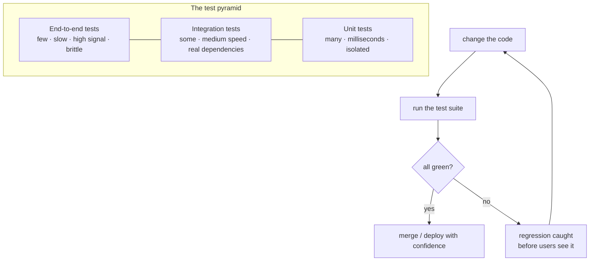

## In simple terms

**Testing** in software means writing extra code whose job is to *run* your real code and check the results. Tests turn "I think it works" into "the machine just confirmed it works" — and they run again every time the code changes, so regressions get caught before users do.

## The Visual Map



## More detail

Tests are usually classified by scope:

- **Unit test** — one function or class, no I/O. Fast (milliseconds), runs by the thousand.
- **Integration test** — several components together, often against a real database. Slower, fewer.
- **End-to-end (E2E) test** — drives the whole system the way a user would. Slow, brittle, but high signal.
- **Property-based test** — generate many inputs and check *invariants* instead of hard-coded examples.
- **Fuzz test** — bombard a function with random/malformed inputs to find crashes.
- **Smoke test** — a minimal "does it even start?" check after a deploy.

The **test pyramid** is the guiding heuristic: many fast unit tests at the base, fewer integration tests, very few E2E tests at the top — because cost and brittleness rise as scope grows.

Conventions and tools by ecosystem: JavaScript (Jest, Vitest, Playwright for E2E), Python (pytest, unittest), Java (JUnit), Rust (`cargo test`, built in), Go (`go test`, built in). A good test has a clear behavioural name, sets up and cleans up its own data, asserts one thing, fails for an obvious reason, and runs deterministically.

## Under the Hood

Test frameworks are less magic than they look: collect functions named `test_*`, run each, and tally which raised an assertion error. Here is a working micro-runner — and it catches a planted "swapped arguments" bug:

```python
#!/usr/bin/env python3
"""A 15-line test runner — the essence of pytest/unittest."""

# --- code under test ---
def add(a, b):      return a + b
def subtract(a, b): return b - a          # BUG: operands swapped!

# --- tests (named test_*) ---
def test_add():          assert add(2, 3) == 5
def test_add_negative(): assert add(-1, 1) == 0
def test_subtract():     assert subtract(5, 3) == 2   # expects 2, gets -2

def run_tests(namespace):
    tests = {n: f for n, f in namespace.items() if n.startswith("test_")}
    passed = failed = 0
    for name, fn in sorted(tests.items()):
        try:
            fn()
            print(f"  PASS {name}"); passed += 1
        except AssertionError:
            print(f"  FAIL {name}: assertion did not hold"); failed += 1
    print(f"\n{passed} passed, {failed} failed of {len(tests)}")

run_tests(globals())     # -> test_subtract FAILS, exposing the bug
```

The runner reports `test_subtract` failing — the swapped operands return `-2` instead of `2`. Real frameworks add discovery, fixtures, rich assertion diffs, and parallelism, but this collect-run-tally loop is the heart of all of them.

## Engineering Trade-offs

**Speed/isolation vs. realism (the pyramid)**
Unit tests are fast and pinpoint failures precisely, but they mock away the rest of the system, so they can all pass while the integrated product is broken. E2E tests exercise the real thing and catch integration bugs, but they're slow, flaky, and vague about *where* the failure is. The pyramid is the pragmatic balance: lean on cheap unit tests, use a thin layer of E2E for the critical user journeys.

**Confidence vs. maintenance cost**
Every test is also code you must maintain. Tests coupled to *implementation* details break on every refactor and become a drag; tests coupled to *behaviour* survive refactors and pay for themselves. More tests isn't strictly better — the goal is maximum confidence per line of test code, which favours behavioural tests with meaningful assertions.

**Example-based vs. property-based**
Hand-written example tests are concrete and readable but only check the cases you thought of. Property-based testing generates thousands of inputs and checks invariants, finding edge cases humans miss — at the cost of harder-to-write properties and non-deterministic failures you must reproduce with a recorded seed.

**Test now vs. ship now**
Writing tests slows down the *first* commit and speeds up everything after it — refactors, new features, and debugging all get cheaper and safer. Skipping tests buys short-term velocity and pays compound interest in regressions later. The break-even is fast for anything that will be changed more than once.

## Real-world examples

- A typo that swaps two function arguments is caught by a unit test the instant you save — exactly the bug the runner above exposes.
- An E2E test for "user signs up and receives a welcome email" guards the single most important flow in a SaaS product against silent breakage.
- **Property-based testing** (QuickCheck, Hypothesis, fast-check) has uncovered real bugs in PostgreSQL, OpenSSL, and many language standard libraries that example tests missed for years.
- **Coverage-guided fuzzing** (libFuzzer, OSS-Fuzz) continuously tests parsers and codecs in Chrome, curl, and the Linux kernel, finding security bugs at scale.

## Common misconceptions

- **"100% coverage means the code is correct."** Coverage measures which lines *executed*, not whether the assertions are meaningful. You can have 100% coverage with tests that assert nothing useful.
- **"Tests slow you down."** They slow the first commit and accelerate every change after it; untested code is the code that rots fastest because no one dares touch it.
- **"If it compiles / type-checks, I don't need tests."** Types rule out whole classes of errors but not logic bugs — a swapped argument of the same type type-checks fine and still ships the wrong answer.

## Try it yourself

Write and run real tests with Python's built-in `unittest` — no installs. Here we test a temperature conversion, including an `assertAlmostEqual` for floating-point:

```bash
python3 - << 'EOF'
import unittest

def to_celsius(f):
    return (f - 32) * 5 / 9

class TempTests(unittest.TestCase):
    def test_freezing(self): self.assertEqual(to_celsius(32), 0)
    def test_boiling(self):  self.assertEqual(to_celsius(212), 100)
    def test_body(self):     self.assertAlmostEqual(to_celsius(98.6), 37.0)

unittest.main(argv=[""], exit=False, verbosity=2)
EOF
```

All three pass (`OK`). Now break `to_celsius` — change `* 5 / 9` to `* 9 / 5` — and re-run: the suite turns red and tells you exactly which expectations failed. That red/green feedback, running automatically on every change, is the entire value of testing.

## Learn next

- [Unit test](/t/unit-test) — the fast, isolated base of the pyramid, examined in detail: scope, mocking, and what makes a good one.
- [Code review](/t/code-review) — the human complement to automated tests; together they form a team's quality gate.
- [CI/CD](/t/ci-cd) — the pipeline that runs your whole test suite automatically on every push, so failing tests block bad merges.
