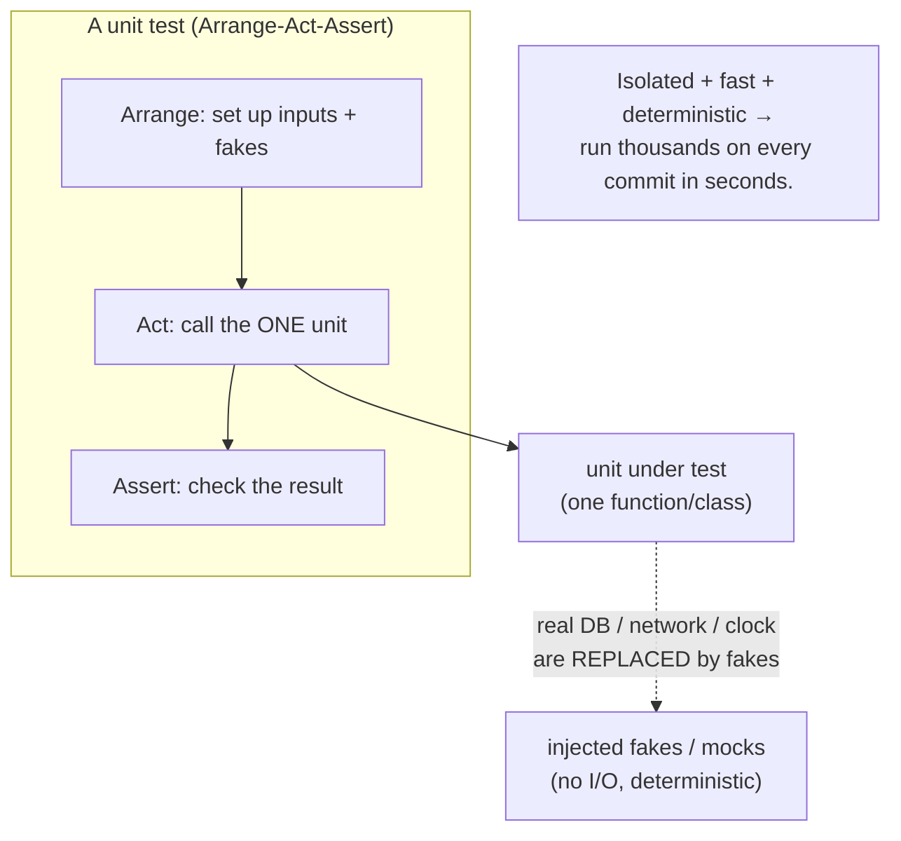

## In simple terms

A **unit test** exercises one small piece of code in isolation — a function, a class, a method — and asserts what it does. Unit tests are fast (milliseconds each), don't touch the network or the database, and run by the thousands. They form the broad base of the **testing pyramid**.

## The Visual Map



## More detail

What makes a good unit test:

- **Fast** — milliseconds, ideally under ~10 ms each. Slow unit tests destroy the development inner loop.
- **Isolated** — no real I/O, no shared state, no order-dependent results; external dependencies are replaced with fakes/mocks.
- **Deterministic** — same input, same output, every time (no real clock, no real randomness).
- **Focused** — one behaviour per test, one reason to fail.
- **Named clearly** — describe the behaviour, not the implementation: `rejects_email_without_at_sign`, not `test_validate_2`.

The **Arrange-Act-Assert** (AAA) pattern is the standard structure: set up inputs and fakes, call the unit, assert the result. Tools vary by language — pytest/unittest (Python), Vitest/Jest (JS), JUnit (Java), `cargo test` (Rust), `go test` (Go) — but the shape is identical.

Two important variants: **Test-Driven Development** (write the failing test first, then the code) and **property-based testing** (generate many random inputs and assert an *invariant* rather than hard-coded examples). What unit tests *can't* tell you: whether services talk to each other correctly (that's [integration tests](/t/integration-test)), whether the user flow works (E2E), or whether a real database query is right.

## Under the Hood

The defining trait of a unit test is **isolation** — achieved by *injecting* dependencies instead of reaching for the real world. Here `greeting` takes the time as an argument rather than calling the clock, so the tests are fully deterministic and can even check the boundary:

```python
#!/usr/bin/env python3
"""Isolation via dependency injection: pass 'now' in, don't read the real clock."""
import unittest
from datetime import time

def greeting(now):                       # 'now' is injected -> deterministic, testable
    if now < time(12): return "good morning"
    if now < time(18): return "good afternoon"
    return "good evening"

class GreetingTests(unittest.TestCase):
    def test_morning(self):       self.assertEqual(greeting(time(9, 0)),  "good morning")
    def test_afternoon(self):     self.assertEqual(greeting(time(14, 0)), "good afternoon")
    def test_evening(self):       self.assertEqual(greeting(time(20, 0)), "good evening")
    def test_boundary_noon(self): self.assertEqual(greeting(time(12, 0)), "good afternoon")

unittest.main(argv=[""], exit=False, verbosity=2)
```

Had `greeting` called `datetime.now()` internally, the tests would depend on *when* they run — flaky and impossible to test the boundary. Injecting `now` makes the unit isolated and deterministic. The same trick (pass in the database, the random source, the HTTP client) is how real units are tested without real I/O.

## Engineering Trade-offs

**Isolation vs. realism**
Replacing real dependencies with fakes makes unit tests fast, deterministic, and precise about *where* a failure is. But every fake is an assumption about how the real thing behaves; if the fake drifts from reality, the unit tests stay green while production breaks — which is exactly the gap integration tests exist to close.

**Coverage as a target vs. as a metric**
Tracking line coverage is useful for finding *untested* code, but turning a coverage number into a goal invites gaming: tests that execute lines without meaningful assertions (a test with no `assert` still earns coverage). High coverage with weak assertions is false confidence; the goal is meaningful assertions, not a percentage.

**Test now vs. design pressure**
Writing unit tests forces you to make code testable — small functions, injected dependencies, clear interfaces — which usually improves the design. The cost is up-front effort and the temptation to over-engineer seams you don't need. Code that's hard to unit test is often a signal of tight coupling worth fixing anyway.

**Mocking depth vs. brittleness**
Mocks let you isolate a unit from slow or unavailable collaborators. Over-mock, though, and tests become coupled to *how* the code calls its collaborators (call counts, argument order) rather than *what* it produces — so they break on every refactor and test the mock instead of the behaviour.

## Real-world examples

- The **Linux kernel** runs KUnit in-tree: small, focused tests that catch regressions in core code paths without booting a full system.
- **TypeScript's** compiler test suite runs tens of thousands of cases in seconds, which is why TS releases ship as confidently and frequently as they do.
- **Property-based** unit tests (Hypothesis, fast-check, proptest) have found edge-case bugs in standard libraries that example tests missed for years.
- Coverage tools (`pytest-cov`, Istanbul) report which lines your unit tests exercise — useful for finding gaps, with the caveat that coverage ≠ correctness.

## Common misconceptions

- **"100% coverage means correct code."** Coverage measures which lines *ran*, not whether the assertions are meaningful — a test with no `assert` still counts toward coverage.
- **"Unit tests can replace integration tests."** They complement each other: unit tests catch logic bugs in isolation; integration tests catch *wiring* bugs between components that every unit's fakes hide.
- **"A test that touches the database is still a unit test."** Once it does real I/O it's no longer isolated, fast, or deterministic — that's an integration test, and it belongs higher on the pyramid.

## Try it yourself

Write a **property-based** unit test — instead of hard-coded examples, generate 1000 random inputs and assert *invariants* that must always hold. This is how tools like Hypothesis find edge cases you'd never enumerate by hand:

```bash
python3 - << 'EOF'
import random

def reverse(xs):    return xs[::-1]
def is_sorted(xs):  return all(xs[i] <= xs[i+1] for i in range(len(xs) - 1))

random.seed(0)
for _ in range(1000):
    xs = [random.randint(0, 100) for _ in range(random.randint(0, 10))]
    # Invariant 1: reversing twice is the identity
    assert reverse(reverse(xs)) == xs
    # Invariant 2: sorted() output is ordered and keeps the same elements
    s = sorted(xs)
    assert is_sorted(s) and sorted(xs) == s and len(s) == len(xs)

print("1000 random cases passed: reverse(reverse(x)) == x, sorted() ordered + same length")
EOF
```

Each loop is effectively a tiny unit test on random data, checking a *property* rather than a specific answer. Now break an invariant — change `reverse` to drop the last element (`xs[::-1][:-1]`) — and the assertion fails on the first non-empty list, pinpointing the bug across a thousand cases.

## Learn next

- [Integration test](/t/integration-test) — the next tier of the pyramid: several real components together, catching the wiring bugs unit tests' fakes hide.
- [Test-driven development](/t/test-driven-development) — the discipline of writing the failing unit test *before* the code, letting tests drive design.
- [CI/CD](/t/ci-cd) — the pipeline that runs your whole unit-test suite automatically on every push, turning fast tests into a merge gate.
